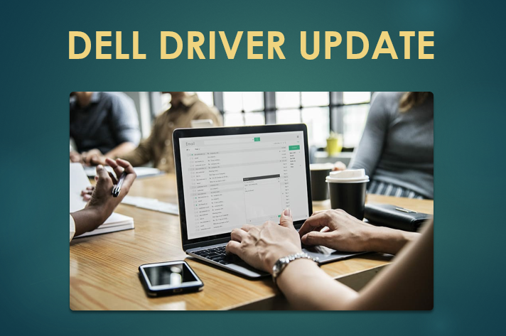

# Dell Driver Update- The unique link between your Dell PC and Devices 

**Get into the dell driver update world**. Your Dell PC's functions and coordination with other devices and operating system running on your PC are in the hands of [**dell driver update**]() . To get your PC work accomplished with best of its efficiency **dell driver update** is here to do this for you . It lets computer to remain protected and work with utmost accuracy.

## Why to go go for dell driver update?

Get [**Dell driver updates**]() and enjoy in-hand benefits :-
 

### Hit critical issues -

This is especially designed for consumers and computers of clients . Moreover they are liable to get device drivers updated and critical issues addressed .

### Self-updation system -

It is best of the features to provide updates and notification , without user's need to check it .

### Supports varied laptops - 

Dell Inspiron, Vostro, XPS,etc are some of the instances of laptops supported by [**Dell driver updates**]() software
Compatibility with Windows-dell driver update facilitates its Windows users with its prime benefits.

## Gateway to Dell driver download  and installation

1.  Visit  Dell website where [**Dell driver updates**]() are available .
2. Then get your Dell product identified
3. You need to tap **Download & Install Support Assist**.
This allows to determine dell product automatically.
4. You need to look for on-screen prompts.
5. Select **'Check for Updates'**.
6. Get to know the location for driver download via **(a)Keyword search box**   **(b)Operating System & Category filters**
7. Download driver by clicking on Download button
8. On Windows Explorer , reach downloaded file .
9. Further Double-click **.exe driver installation file**. 
10. Follow on-screen prompts.
    As soon as the driver installed , **Restart** your computer

